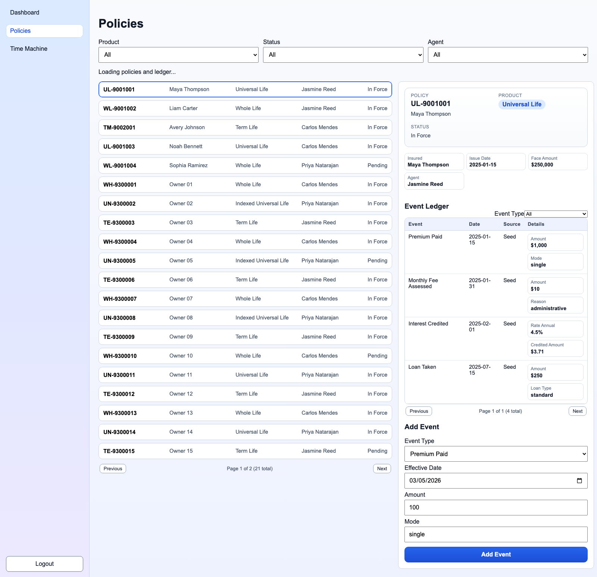
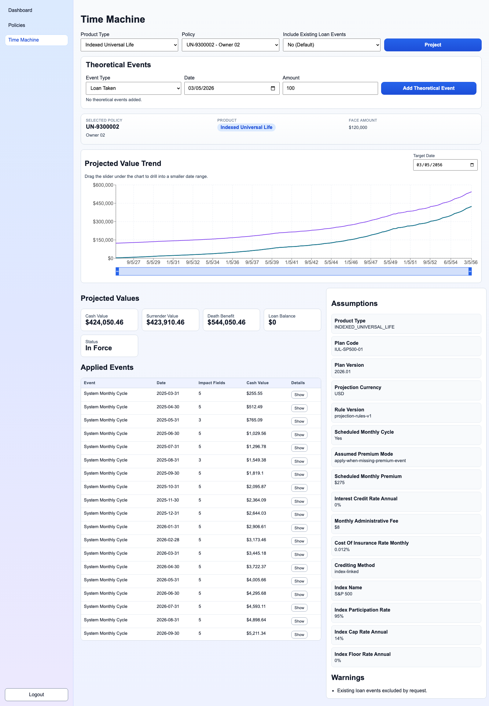

# PAS Prototype

Standalone Policy Administration System (PAS) prototype focused on explainable, date-based policy projections.

Stack:
- Backend: FastAPI + Pydantic
- Frontend: React + TypeScript + Vite
- Persistence: local JSON files (`backend/localdb/*.json`)

## Why This Design

This project is intentionally optimized for demo speed and clarity:
- Event-sourced projection model: replay policy events to any `as_of_date`.
- Product strategy pattern: separate projection behavior by product type.
- Explainable output: each projection returns ordered applied events with deltas and running totals.
- JSON-first persistence: no database setup required for local demos and exploration.

Tradeoff:
- Fast iteration and debuggability over production-grade durability/scalability.

## Current Product Coverage

Supported product types:
- Term Life
- Whole Life
- Universal Life
- Indexed Universal Life (IUL)

Supported policy event types (MVP scope):
- `PREMIUM_PAID`
- `MONTHLY_FEE_ASSESSED`
- `LOAN_TAKEN`
- `LOAN_REPAID`
- `RIDER_CHANGED`
- internal/system monthly cycle events generated by projection rules

## Repository Layout

- `backend/app/main.py`: API routes, middleware, app wiring
- `backend/app/models.py`: Pydantic request/response/domain models
- `backend/app/auth.py`: login/session auth and token verification
- `backend/app/repository.py`: local JSON repository + safe-write behavior
- `backend/app/projection_engine.py`: replay engine + product strategies
- `backend/localdb/*.json`: fixture data for users/agents/plans/policies/events
- `src/views/*`: React views (login, policies, time machine)
- `src/domain/projection/*`: frontend projection domain formatting/tests
- `docs/build_plan.md`: phased implementation checklist
- `docs/architecture.md`: system architecture and request/data flow diagram
- `docs/demo_script.md`: step-by-step demo script

## Prerequisites

- Python 3.11+
- Node 20+
- npm 10+

## Setup

Backend:

```bash
cd backend
python3 -m venv .venv
source .venv/bin/activate
pip install -r requirements.txt
uvicorn app.main:app --reload --port 8000
```

Frontend:

```bash
npm install
npm run dev
```

Run both in one command (from repo root):

```bash
npm run dev:all
```

## Environment Variables

Backend:
- `PAS_AUTH_SECRET`: token signing secret (set in non-dev environments)
- `PAS_AUTH_ISSUER`: JWT issuer (default `pas-prototype`)
- `PAS_AUTH_AUDIENCE`: JWT audience (default `pas-web`)
- `PAS_CORS_ALLOWLIST`: comma-separated origins

Frontend:
- `VITE_API_BASE_URL`: backend base URL (default `http://127.0.0.1:8000`)

## Demo Credentials

- Email: `demo.admin@pas.local`
- Password: `ChangeMe123!`

## API Surface (MVP)

- `GET /health`
- `POST /api/auth/login`
- `GET /api/auth/session`
- `GET /api/agents`
- `GET /api/product-plans`
- `GET /api/policies`
- `GET /api/policies/{policy_id}`
- `GET /api/policies/{policy_id}/events`
- `POST /api/policies/{policy_id}/events`
- `POST /api/policies/{policy_id}/projection`

## JWT Implementation

- Login (`POST /api/auth/login`) issues signed JWT access tokens.
- Signing algorithm: `HS256` (shared secret via `PAS_AUTH_SECRET`).
- Token claims include: `sub`, `email`, `roles`, `iat`, `nbf`, `exp`, `iss`, `aud`, `typ`.
- Protected routes require `Authorization: Bearer <token>`.
- Backend verifies signature, expiry, issuer, audience, and required claims.

## Projection Engine Notes

Core approach:
- Replay all policy events with effective-date ordering and deterministic tiebreaks.
- Maintain a shared ledger state (premium paid, cash value, charges, loan balance, death benefit basis).
- Apply product-specific rules through strategy implementations.
- Return `ProjectionSnapshot` with:
  - `values` (cash value, surrender value, death benefit, loan balance, status)
  - `assumptions`
  - `appliedEvents` (delta + running totals)
  - `warnings`

This is not actuarial pricing software. It is an explainable prototype projection model.

## Quality Gates

Run full verification:

```bash
npm run verify
```

This executes:
- Type checks (`npm run lint`)
- Backend tests (`npm run test:backend`)
- Frontend tests (`npm run test:frontend`)
- Production build (`npm run build`)

## Design Docs

- Architecture: [`docs/architecture.md`](./docs/architecture.md)
- Demo script: [`docs/demo_script.md`](./docs/demo_script.md)
- Build phases/checklist: [`docs/build_plan.md`](./docs/build_plan.md)

## Production Readiness Roadmap

High-priority steps before production use:

1. Persistence and data safety
- Replace JSON files with a transactional datastore (PostgreSQL).
- Add migrations, schema constraints, and rollback strategy.
- Introduce optimistic locking/versioning for concurrent writes.

2. Authentication and authorization
- Move from local symmetric JWT auth to managed OIDC/JWKS with key rotation and stricter token lifecycle policy.
- Add role- and permission-based authorization checks per endpoint.
- Add audit logs for auth and policy mutations.

3. Security hardening
- Secrets via secure vault/env management.
- Strict CORS policy per environment.
- Rate limiting backed by Redis or gateway-level controls.
- Input/output threat protections (validation policy, security headers, abuse controls).

4. Projection governance
- Version projection rules formally and persist rule version per result.
- Add regression test packs with locked expected outputs.
- Add explainability trace IDs and reproducibility metadata.

5. Reliability and operations
- Structured logging, metrics, tracing, and dashboards.
- Health checks that include dependency status.
- Containerization and CI/CD with staged deployments.
- Backup/restore runbooks and incident response procedures.

6. API and UX maturity
- Pagination/sorting on list endpoints.
- Better error taxonomy and client-safe diagnostics.
- Async projection jobs for large portfolios.
- Historical projection storage and compare views.

## Quick Demo Flow

1. Login.
2. Open Policies, filter list, select a policy.
3. Add a policy event and confirm ledger update.
4. Open Time Machine.
5. Select policy/date and run projection.
6. Add a theoretical event and rerun to show delta.
7. Review projected values, assumptions, chart trend, and applied-event timeline.

## Screenshots

### Policies Page



### Time Machine Graph Page


